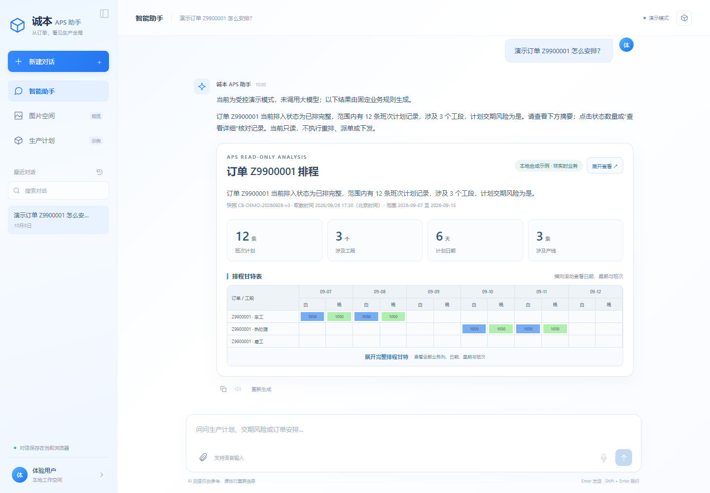
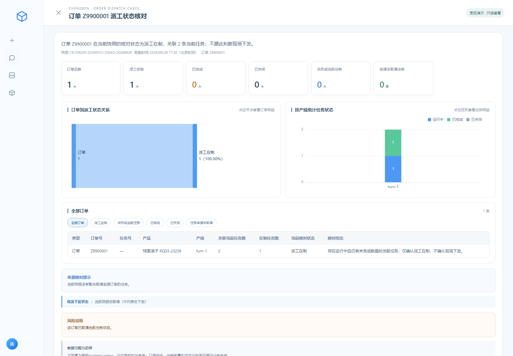

# 诚本 APS 生产计划排程助手

面向制造业计划人员的对话查询原型：用自然语言查看生产计划、交期风险、单订单排程、物料齐套和派工在制情况，再展开指标、矩阵甘特表与明细核对。

**定位：只读 APS 查询助手。** 已实现模型工具调用与固定图表渲染；本仓库只携带 13 个订单的受控模拟快照，默认无需密钥即可演示。



## 核心设计

```text
自然语言问题 → 模型识别意图与条件 → 业务工具生成事实与 UI 数据
                                      ├→ 简短事实交给模型说明
                                      └→ 完整明细交给前端固定渲染
```

模型负责理解与说明，数量、状态和图表数据由工具确定性生成。聊天先给结论和摘要，再通过“查看详情”展开证据。完整图表数据不会进入模型上下文。

## 本地运行

需要 Docker 与 Docker Compose。在仓库根目录执行：

```bash
# 首次复制；不要覆盖已填写的配置
cp .env.example .env
docker compose --env-file .env up -d --build --wait
```

Windows PowerShell 首条命令为 `Copy-Item .env.example .env`。打开 <http://127.0.0.1:19440/>。

默认 `AGENT_MODE=demo` 使用确定性意图路由，不调用大模型。要体验模型工具调用，在本地 `.env` 中设置 `AGENT_MODE=model`，填写 `SK_ENDPOINT`、`SK_API_KEY`、`SK_MODEL_ID`，再运行上述 Compose 命令。模型模式仍查询模拟快照，不会变成真实业务数据库。语音为可选能力，另需供应商配置。

停止本作品集容器：`docker compose --env-file .env down`。

## 推荐演示

1. 问“生产计划怎么样？”或“哪些订单有交期风险？”，查看摘要并展开计划。
2. 连续问“演示订单 Z9900001 怎么安排？”“演示订单 Z9900001 的物料齐套状态如何？”“演示订单 Z9900001 派工了吗？”，核对同一个订单的三类记录。
3. 展开派工明细，点击状态柱形，查看按产线和状态筛选的任务。

模拟快照取数时间为 `2026-09-26 17:30`。订单、计划、物料与派工的关联只表示同一演示时点的记录，不能据此推断真实现场进度或因果。



## 产品与验证材料

- [产品设计说明](docs/product-design.md)：业务问题、工具分工、数据边界与面试展示要点。
- [验证记录](docs/verification.md)：本次副本的构建、测试与演示核对。

```bash
pnpm --dir web-frontend install --frozen-lockfile
pnpm --dir web-frontend build
node --test tests/frontend/*.test.mjs
dotnet test tests/unit/WePilot.Tests.csproj -c Release
node tests/interfaces/linked-demo.mjs
node tests/interfaces/order-dispatch.mjs
```

单元测试需要 .NET 6 SDK；接口测试需要启动本仓库服务。`tests/agent-evals/linked-demo.mjs` 用于配置模型后的工具调用评测，demo 路由检查不能代替模型评测。

## 技术与目录

Vue 3 / Vite / Pinia / ECharts；ASP.NET Core 6 / Semantic Kernel；HTTP SSE；Docker Compose。

```text
web-frontend/          会话、卡片、图表与明细
agent-backend/         意图编排、业务工具和模拟快照
speech-ark-backend/    可选语音服务
dev-config/           Dockerfile 和 Nginx 配置
tests/                前端、后端与关联场景检查
docs/                 产品说明和截图
.env.example          无密钥配置模板
compose.yml           独立演示运行配置
```

第一阶段只读，不执行插单、改排、派单或业务写回。真实订单只读快照适配代码保留，但仓库不包含真实快照和数据库导出脚本；未配置时明确返回数据不可用。生产是否完成、缺料原因与按期交付不能由计划状态直接推断。本仓库不包含原工程历史、内部资料和日期分组目录。
